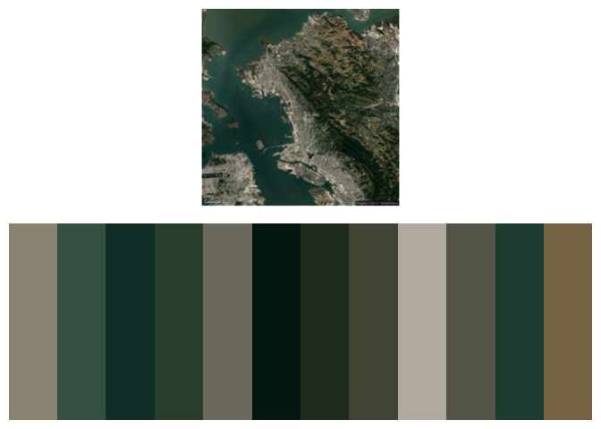
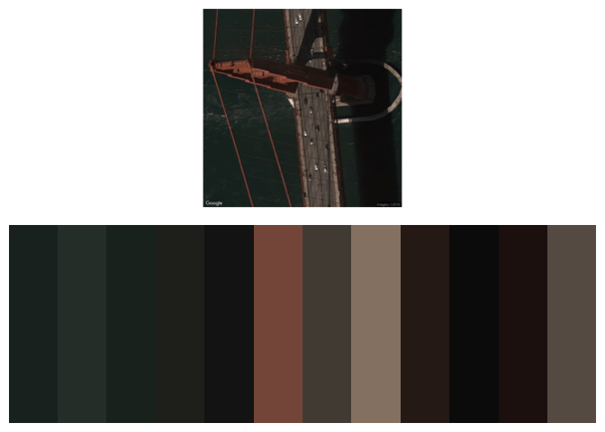
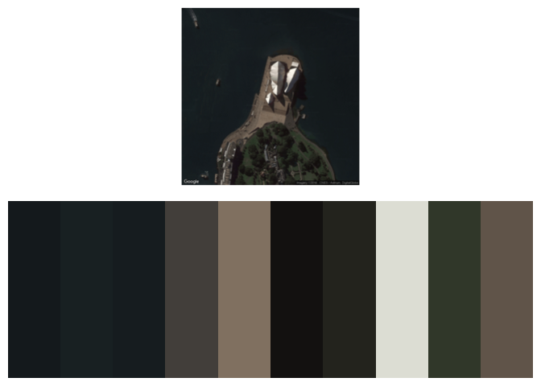
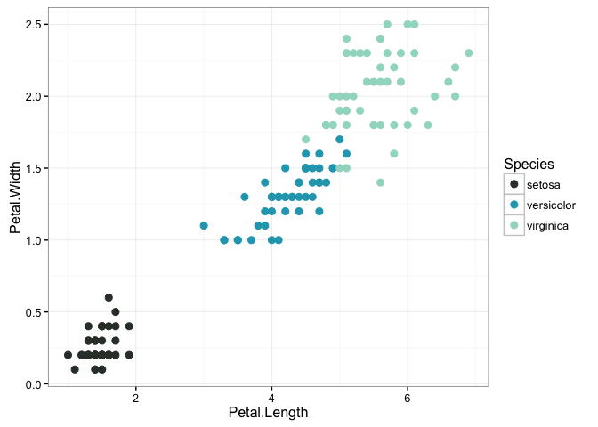
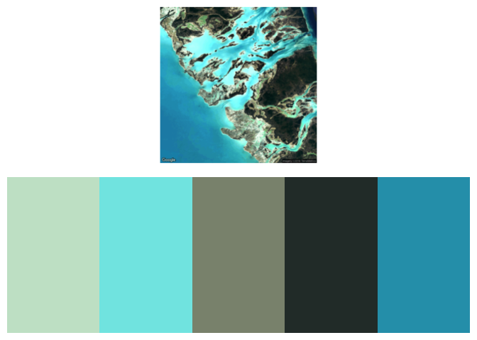

earthtones
================

[](https://travis-ci.org/wcornwell/earthtones) [](https://codecov.io/github/wcornwell/earthtones/)

Here is how to install the package:

``` r
if(!require(devtools)) install.packages("devtools")
devtools::install_github("wcornwell/earthtones")
library("earthtones")
```

Find the color pallette of particular parts of the world
--------------------------------------------------------

This package does a few simple things: 1) downloads a satelitte image, 2) translates the colors into a perceptually uniform color space, 3) runs a clustering method, and 4) returns a color pallette.

There is only one function `get_earthtones`. Here is how you use it, in this case for the grand canyon:

``` r
get_earthtones(latitude = 36.094994, longitude=-111.837962, 
               zoom=12, number_of_colors=8)
```


`number_of_colors` corresponds to how many colors you want back. The `zoom` value is passed to `ggmap::get_map`--essentially larger values zoom closer to the target lat+long.
Maybe desert colors aren't your thing: you want a color scheme drawn from tropical reefs and lagoons. How about the Bahamas?

``` r
get_earthtones(latitude = 24.2, longitude=-77.88, zoom=11, number_of_colors=5)
```


Just pick your favorite place in the world, and find out the major colors

Here is San Francisco:

``` r
get_earthtones(latitude = 37.89, longitude=-122.28, zoom=11, number_of_colors=12)
```



or the golden gate bridge:

``` r
get_earthtones(latitude = 37.81391, longitude=-122.478289, zoom=19, number_of_colors=12)
```



or Sydney Opera House :

``` r
get_earthtones(latitude = -33.857077, longitude=151.214722, zoom=17, number_of_colors=12)
```



If you want to actually use the color scheme for graphing or something and not just plot pretty picturs, there is a switch in the `get_earthtones` function: just add `include.map==FALSE` to the function call, and the function will only return the color palette for later use:

``` r
if(!require(ggplot2)) install.packages("ggplot2")
bahamas_colors <- get_earthtones(latitude = 24.2,
      longitude=-77.88, zoom=11, number_of_colors=3,include.map=FALSE)
ggplot(iris, aes(x=Petal.Length, y=Petal.Width, col=Species))+
  geom_point(size = 2.5)+
  scale_color_manual(values = bahamas_colors)+
  theme_bw()
```



And now Fisher's irises are colored in a Bahama style. However, actually data from two of the three iris speces was collected by a botanist named Edgar Anderson from the [Gaspé Peninsula in Quebec](https://www.jstor.org/stable/2394164?seq=1#page_scan_tab_contents), so it might be better to use a color scheme from there for those two species.

``` r
iris.from.gaspe <- dplyr::filter(iris, Species!="virginica")

get_earthtones(latitude = 48.7709,
  longitude=-64.660939,zoom=9,number_of_colors = 2)
```


``` r
gaspe <- get_earthtones(latitude = 48.7709,
  longitude=-64.660939 ,zoom=9, number_of_colors = 2,include.map=FALSE)
ggplot(iris.from.gaspe, aes(x=Petal.Length, y=Petal.Width,col=Species))+
  geom_point(size = 2.5)+
  scale_color_manual(values = gaspe)+
  theme_bw()
```


Some notes on clustering methods
--------------------------------

There are lots of ways to do the clustering of the colors. The default is pam algorithm but there is also the k-means, which is a bit simpler.

Here is the k-means result for the bahamas:

``` r
get_earthtones(latitude = 24.2, longitude=-77.88,
               zoom=11, number_of_colors=5, method="kmeans")
```



and here is the pam one

``` r
get_earthtones(latitude = 24.2, longitude=-77.88, 
               zoom=11, number_of_colors=5, method="pam")
```


The sand-color is perhaps a bit sandier with the pam approach.
